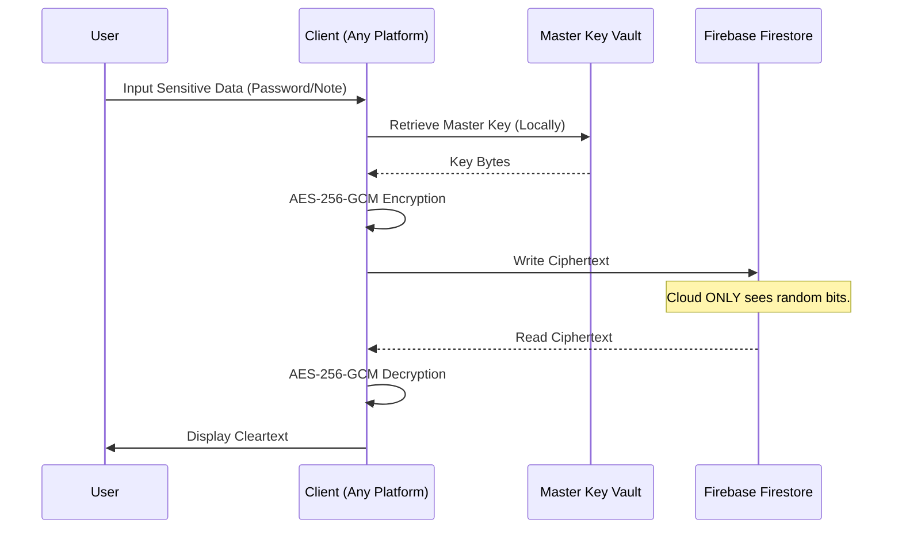

# LifeHub Ecosystem: Professional Monorepo Documentation

LifeHub is a mission-critical, high-security personal data ecosystem designed for real-time synchronization across mobile (Android), stationary (Web Dashboard), and quick-access (Browser Extension) platforms. 

This repository implements a monorepo structure to unify the three platforms under a single security and data integrity umbrella, powered by a decentralized encryption-first mindset.

---

## 1. System Architecture & Component Mapping

The system is architected as a **Quad-Tier Distributed Infrastructure**. Data flows through hardened client-side layers before reaching the synchronized cloud hub.

---

## 2. Technical Component Breakdown

### 2.1. Android Platform (`/android`)
The native Android tier follows the **MVVM + Repository + Hilt** architectural standard.

- **Core Security Engine:** 
  - `CrossPlatformEncryptionHelper.java`: Implements a specialized version of AES-256-GCM designed to match JavaScript's Web Crypto API, ensuring cross-platform decryption.
  - `BiometricHelper.java`: Bridges Android KeyStore with the BiometricPrompt API for hardware-backed security.
- **Service Layer:**
  - `LifeHubAutofillService.java`: A custom Service implementation allowing LifeHub to act as a system-wide pass manager.
  - `LifeHubAccessibilityService.java`: Specifically tuned for browser autofill detection.
- **Modularity:** 
  - `features/one_accounts`: Manages encrypted login credentials.
  - `features/two_productivity`: Houses the Notes and Task micro-services.
  - `features/four_calendar`: Implements the calendar engine.

### 2.2. Web Platform (`/web`)
The Web tier is a specialized dashboard for deep data management.

- **State Management:** Uses custom React hooks (`useNotes`, `useTasks`, `useAuth`) to decouple UI components from Firestore listeners.
- **Utility Layer:** 
  - `encryption.ts`: The web-side implementation of the global encryption standard.
  - `lunarUtils.ts`: Specialized engine for handling traditional lunar-solar date conversions.
  - `totp.ts`: Implements the RFC 6238 standard for real-time 2FA generation.

### 2.3. Browser Extension Platform (`/extension`)
Optimized for low-latency retrieval of credentials and schedule overview.

- **Background Service Worker (`background.js`):** Manages the persistent session and inter-script messaging.
- **Quick-Access UI:** Built with localized libraries (`firebase-app.js`, `firebase-auth.js`) to eliminate external script dependencies, enhancing security and speed.
- **Calendar Engine:** Features a specialized horizontal date-strip UI for high-density event visualization.

---

## 3. Data Infrastructure and Sync Logic

### 3.1. Database Schema (Firestore)
LifeHub uses a user-centric sub-collection model. All paths are prefixed with the User UID.

- **`users/{uid}/accounts`**: Each document stores a `serviceName`, `username`, and `password` (Ciphertext).
- **`users/{uid}/tasks`**: Supports hierarchical sub-tasks via `projectId` references.
- **`users/{uid}/calendar`**: Real-time event documents with `startTime`, `endTime`, and `location`.
- **`users/{uid}/notes`**: Large-text documents with `title` and `content` (Ciphertext).

### 3.2. Global Sync Flow
1. **Mutation:** A platform (e.g., Android) performs a `set()` or `update()` call on a Firestore document.
2. **Push:** Firestore's real-time engine propagates the change to all authenticated listeners.
3. **Decryption:** Targeted platforms (Web/Ext) receive the new Ciphertext and use the shared Master Key stored in their local secure vault (KeyStore/LocalStorage) to decrypt and display.

---

## 4. Encryption & Privacy Mechanics

LifeHub operates on a **Zero-Knowledge Knowledge Base (ZKKB)** principle for sensitive fields.

### 4.1. Key derivation
Master Keys are derived from user-provided PINs/Passwords using PBKDF2 with 100,000+ iterations on client devices, ensuring that the raw password never travels to the cloud.

---

## 5. Deployment & Configuration Matrix

### 5.1. File Mapping for Setup
| Requirement | Android Path | Web Path | Extension Path |
|:---|:---|:---|:---|
| Firebase Config | `android/app/google-services.json` | `web/.env` | `extension/popup/libs/firebase-config.js` |
| Weather API | `android/local.properties` | `web/.env` | N/A |
| Build Tool | `Gradle 8.x` | `Vite 5.x` | `Manifest V3` |

### 5.2. Git Readiness
The repository is strictly configured to protect secrets:
- **Exclusion:** All `.jks`, `.keystore`, `.env`, and private JSON configs are matched in `/.gitignore`.
- **Redaction:** Source code contains NO hardcoded credentials. All configuration is injected via build-time `BuildConfig` or runtime `import.meta.env`.

---

LifeHub is built for reliability, security, and cross-platform synergy.

*Engineering Excellence - Securing Your Digital Future.*
