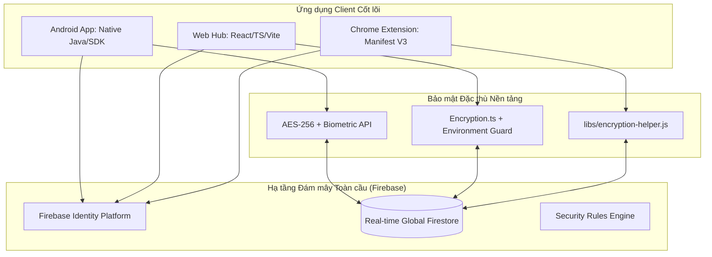
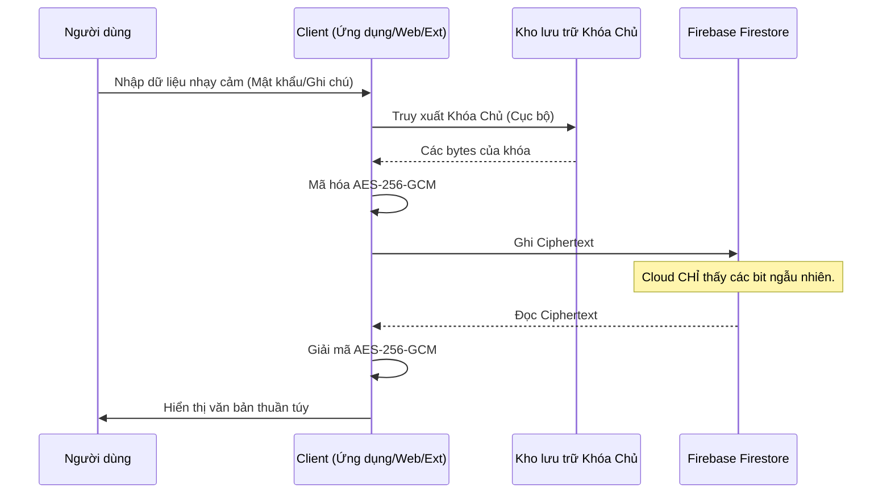

# Hệ sinh thái LifeHub: Tài liệu Kỹ thuật Toàn diện

LifeHub là một hệ sinh thái quản lý dữ liệu cá nhân tích hợp, bảo mật cao, được thiết kế để đồng bộ hóa thời gian thực giữa các nền tảng di động (Android), máy tính (Web Dashboard) và công cụ truy cập nhanh (Browser Extension).

Kho lưu trữ này được cấu trúc theo mô hình **monorepo**, hợp nhất cả ba nền tảng dưới một khung bảo mật và toàn vẹn dữ liệu duy nhất, vận hành dựa trên triết lý ưu tiên mã hóa phi tập trung (decentralized encryption-first).

---

## 1. Kiến trúc Hệ thống và Thành phần

Hệ thống được thiết kế theo **Cấu trúc Cơ sở hạ tầng Phân tán Bốn lớp**. Dữ liệu được xử lý qua các lớp bảo mật nghiêm ngặt ở phía Client trước khi được đồng bộ lên trung tâm đám mây.

---

## 2. Chi tiết Thành phần Kỹ thuật

### 2.1. Nền tảng Android (`/android`)
Ứng dụng Android chạy trực tiếp (native) tuân thủ tiêu chuẩn kiến trúc **MVVM + Repository + Hilt**.

- **Công cụ Bảo mật Cốt lõi:**
  - `CrossPlatformEncryptionHelper.java`: Triển khai phiên bản AES-256-GCM đặc thù, tương thích hoàn toàn với Web Crypto API của JavaScript, đảm bảo khả năng giải mã trên mọi nền tảng.
  - `BiometricHelper.java`: Kết nối Android KeyStore với BiometricPrompt API để bảo mật dựa trên phần cứng.
- **Lớp Dịch vụ (Service Layer):**
  - `LifeHubAutofillService.java`: Tự triển khai dịch vụ Autofill, cho phép LifeHub hoạt động như một trình quản lý mật khẩu cấp hệ thống.
  - `LifeHubAccessibilityService.java`: Được tinh chỉnh để phát hiện và tự động điền thông tin trên trình duyệt.
- **Tính Modul hóa:**
  - `features/one_accounts`: Quản lý thông tin đăng nhập đã mã hóa.
  - `features/two_productivity`: Bao gồm các dịch vụ siêu nhỏ (micro-services) cho Ghi chú và Công việc.
  - `features/four_calendar`: Triển khai công cụ quản lý lịch trình.

### 2.2. Nền tảng Web (`/web`)
Bản Web là một bảng điều khiển (dashboard) chuyên dụng để quản lý dữ liệu chuyên sâu.

- **Quản lý Trạng thái (State Management):** Sử dụng các React hook tùy chỉnh (`useNotes`, `useTasks`, `useAuth`) để tách biệt các thành phần UI khỏi trình lắng nghe Firestore.
- **Lớp Tiện ích (Utility Layer):**
  - `encryption.ts`: Triển khai tiêu chuẩn mã hóa toàn cầu ở phía web.
  - `lunarUtils.ts`: Công cụ chuyên dụng để xử lý chuyển đổi ngày âm dương truyền thống.
  - `totp.ts`: Triển khai tiêu chuẩn RFC 6238 để tạo mã xác thực 2 lớp (2FA) thời gian thực.

### 2.3. Nền tảng Browser Extension (`/extension`)
Được tối ưu hóa để truy xuất thông tin đăng nhập và xem nhanh lịch trình với độ trễ thấp nhất.

- **Background Service Worker (`background.js`):** Quản lý phiên làm việc liên tục và truyền tin giữa các script.
- **Giao diện Truy cập Nhanh:** Được xây dựng với các thư viện cục bộ (`firebase-app.js`, `firebase-auth.js`) để loại bỏ sự phụ thuộc vào script bên ngoài, tăng cường bảo mật và tốc độ.
- **Công cụ Lịch:** Giao diện dải ngày ngang chuyên dụng để trực quan hóa các sự kiện mật độ cao.

---

## 3. Phân tích Chiến lược Hệ thống (Pros & Cons)

Việc đánh giá khách quan các ưu điểm và hạn chế giúp định hướng phát triển trong tương lai và đảm bảo người dùng hiểu rõ giới hạn của hệ thống.

### 3.1. Ưu điểm (Advantages)
- **Bảo mật Đa lớp Thực thụ:** Kết hợp mã hóa phần cứng (Biometric KeyStore) và mã hóa phần mềm (AES-256) đảm bảo ngay cả quản trị viên máy chủ cũng không thể đọc được dữ liệu người dùng.
- **Tính Hiệp đồng (Synergy):** Khả năng chuyển đổi liền mạch giữa môi trường làm việc tập trung (Web) và di động (Android/Extension).
- **Phản hồi Tức thời:** Sử dụng công nghệ WebSocket của Firestore cho phép dữ liệu thay đổi trên điện thoại xuất hiện gần như ngay lập tức trên trình duyệt.
- **Dễ dàng Triển khai:** Cấu trúc Monorepo và các template cấu hình giúp nhà phát triển mới tiếp cận dự án một cách có hệ thống.

### 3.2. Nhược điểm và Thách thức (Disadvantages & Limitations)
- **Phụ thuộc vào Firebase:** Hệ thống gắn chặt với hạ tầng của Google. Nếu Firebase gặp sự cố hoặc thay đổi chính sách giá, việc di chuyển (migration) sang hệ thống khác sẽ đòi hỏi nỗ lực lớn.
- **Quản lý Khóa Chủ (Secret Key Management):** Vì đây là mô hình Zero-Knowledge, nếu người dùng quên Khóa Chủ và không có bản sao lưu, toàn bộ dữ liệu mã hóa sẽ **vĩnh viễn không thể khôi phục**.
- **Hiệu năng với Dữ liệu lớn:** Việc mã hóa/giải mã toàn bộ danh sách (ví dụ: hàng ngàn tài khoản) ngay tại client có thể gây trễ (latency) trên các thiết bị có hiệu năng thấp.
- **Giới hạn Offline:** Mặc dù Firebase hỗ trợ lưu đệm (caching), nhưng các chức năng mã hóa phức tạp và đồng bộ hóa đa thiết bị đòi hỏi kết nối internet ổn định để đảm bảo tính nhất quán.

---

## 4. Hạ tầng Dữ liệu và Logic Đồng bộ

### 4.1. Cấu trúc Cơ sở dữ liệu (Firestore)
LifeHub sử dụng mô hình bộ sưu tập con (sub-collection) lấy người dùng làm trung tâm. Tất cả các đường dẫn đều được tiền tố bằng UID của người dùng.

- **`users/{uid}/accounts`**: Mỗi tài liệu lưu trữ `serviceName`, `username`, và `password` (Dạng mã hóa - Ciphertext).
- **`users/{uid}/tasks`**: Hỗ trợ các công việc con phân cấp thông qua tham chiếu `projectId`.
- **`users/{uid}/calendar`**: Các tài liệu sự kiện thời gian thực với `startTime`, `endTime`, và `location`.
- **`users/{uid}/notes`**: Lưu trữ các văn bản lớn với `title` và `content` (Dạng mã hóa - Ciphertext).

### 4.2. Luồng Đồng bộ Toàn cầu
1. **Thay đổi (Mutation):** Một nền tảng (ví dụ: Android) thực hiện gọi lệnh `set()` hoặc `update()` trên một tài liệu Firestore.
2. **Đẩy dữ liệu (Push):** Công cụ thời gian thực của Firestore truyền bá thay đổi đến tất cả các trình lắng nghe đã xác thực.
3. **Giải mã (Decryption):** Các nền tảng mục tiêu (Web/Ext) nhận Ciphertext mới và sử dụng Khóa Chủ (Master Key) chung được lưu trong kho lưu trữ an toàn cục bộ (KeyStore/LocalStorage) để giải mã và hiển thị.

---

## 5. Cơ chế Mã hóa và Quyền riêng tư

LifeHub hoạt động dựa trên nguyên tắc **Cơ sở kiến thức Không tri thức (Zero-Knowledge Knowledge Base - ZKKB)** đối với các trường dữ liệu nhạy cảm. Dữ liệu thô không bao giờ rời khỏi thiết bị ở dạng văn bản thuần túy.

### 5.1. Dẫn xuất Khóa (Key Derivation)
Khóa Chủ được dẫn xuất từ mã PIN/Mật khẩu do người dùng cung cấp bằng phương thức PBKDF2 với hơn 100,000 vòng lặp trên thiết bị client, đảm bảo mật khẩu gốc không bao giờ được gửi lên đám mây.

---

## 6. Danh mục Triển khai và Cấu hình

### 6.1. Sơ đồ File Cấu hình
| Yêu cầu | Đường dẫn Android | Đường dẫn Web | Đường dẫn Extension |
|:---|:---|:---|:---|
| Cấu hình Firebase | `android/app/google-services.json` | `web/.env` | `extension/popup/libs/firebase-config.js` |
| Weather API | `android/local.properties` | `web/.env` | Không áp dụng |
| Công cụ Build | `Gradle 8.x` | `Vite 5.x` | `Manifest V3` |

### 6.2. Sẵn sàng cho Git (Security Readiness)
Kho lưu trữ được cấu hình nghiêm ngặt để bảo vệ các bí mật:
- **Loại trừ:** Tất cả các tệp `.jks`, `.keystore`, `.env`, và cấu hình JSON riêng tư đều được khớp trong `/.gitignore`.
- **Lọc dữ liệu:** Mã nguồn không chứa bất kỳ thông tin xác thực cứng (hardcoded) nào. Tất cả cấu hình được đưa vào thông qua `BuildConfig` lúc build hoặc `import.meta.env` lúc runtime.

---

LifeHub được xây dựng vì sự tin cậy, bảo mật và tính hiệp đồng đa nền tảng.

