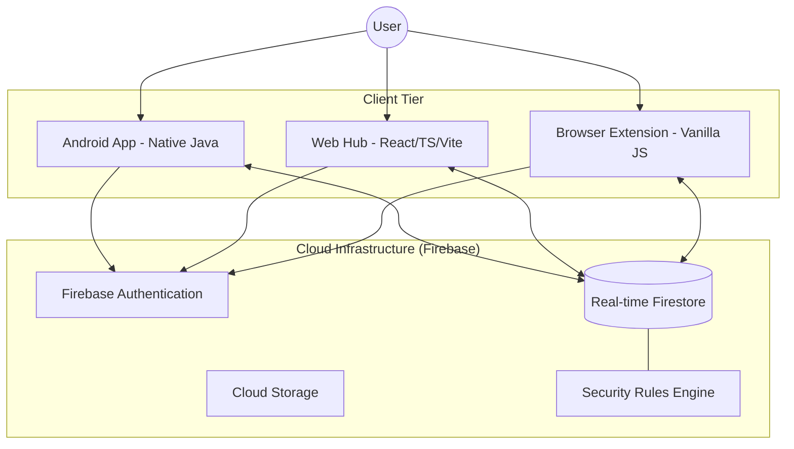

# LifeHub Ecosystem: Technical Documentation

LifeHub is an integrated, multi-platform personal management system designed to centralize and secure digital life data. This repository functions as a monorepo containing the native Android application, the centralized Web dashboard, and the browser-based Quick Access extension.

---

## 1. System Architecture

LifeHub utilizes a unified cloud backend with platform-specific architectures tailored for optimal performance and security.

### 1.1. High-Level System Overview
The following diagram illustrates the synchronization flow between platforms and the central Firebase hub.



### 1.2. Android Architecture (MVVM + Repository)
The Android application is built using the Clean Architecture principles to ensure scalability and testability.

- **UI Layer:** Activities and Fragments observe LiveData from ViewModels.
- **ViewModel Layer:** Handles UI logic and maintains state during configuration changes.
- **Repository Layer:** Abstract data source management, handling real-time Firestore synchronization.
- **Data Source Layer:** Firebase Firestore and SharedPreferences.

### 1.3. Web Architecture
- **Framework:** React 18 with Vite for optimized build performance.
- **State Management:** Custom hooks for modularized data fetching.
- **Styling:** Vanilla CSS with a focus on glassmorphism and premium aesthetics.

### 1.4. Extension Architecture
- **Standard:** Manifest V3.
- **Technology:** Vanilla JavaScript using ES Modules for modularity.
- **Lifecycle:** Background Service Worker handles persistence and communication with content scripts.

---

## 2. Core Functional Modules

### 2.1. Security & Account Management
- **AES-256 Encryption:** All sensitive data is encrypted on the client-side using industry-standard AES-256-GCM before transit.
- **Biometric Integration:** Native Android Biometric API integration for secure local authentication.
- **Advanced TOTP:** Built-in 2FA support with real-time code generation synchronized across all platforms.

### 2.2. Productivity Suite
- **Hierarchical Tasks:** Support for projects and sub-projects with cross-platform filtering.
- **Secure Notes:** Encrypted note-taking with real-time markdown-style rendering.
- **Smart Reminders:** Local AlarmManager integration on Android synchronized with cloud-based task states.

### 2.3. Unified Calendar
- **Cross-Platform Sync:** Dynamic event management with a specialized "Day View" optimized for browser extensions.
- **Conflict Resolution:** Advanced overlap detection and transparent UI rendering for dense schedules.

---

## 3. Data Integrity and Security

### 3.1. Firestore Data Structure
Data is partitioned per user to ensure strict isolation and privacy.

```
users/
  ├─ {userId}/
      ├─ accounts/ (Encrypted Login Data)
      ├─ tasks/ (Productivity Data)
      ├─ notes/ (Encrypted Content)
      ├─ calendar/ (Schedule Metadata)
```

### 3.2. Firebase Security Rules
Access is restricted at the database level to prevent unauthorized data exposure.
```javascript
service cloud.firestore {
  match /databases/{database}/documents {
    match /users/{userId}/{document=**} {
      allow read, write: if request.auth.uid == userId;
    }
  }
}
```

---

## 4. Repository Structure

| Path | Description | Stack |
|:---|:---|:---|
| `android/` | Primary mobile application source. | Java, Gradle, Hilt |
| `web/` | Desktop-optimized dashboard. | React, TypeScript, Vite |
| `extension/` | Browser quick-access tool. | JavaScript, Manifest V3 |
| `firestore.rules` | Security policy for cloud data. | Firebase |

---

## 5. Development and Deployment

### 5.1. Git Security Readiness
This project has been sanitized for public repository deployment. All sensitive configurations are managed through local environment files excluded from version control.

#### Configuration Templates:
- **Android:** `android/app/google-services.json.template`
- **Web:** `web/.env.example`
- **Extension:** `extension/popup/libs/firebase-config.example.js`

### 5.2. Setup Procedures

#### Android Platform
1. Initialize the project in Android Studio by pointing to the `android/` directory.
2. Provide a valid `google-services.json` in `android/app/`.
3. Define `OPENWEATHER_API_KEY` in `android/local.properties`.

#### Web Platform
1. Navigate to the `web/` directory.
2. Execute `npm install` to load dependencies.
3. Configure authentication variables in `.env`.
4. Run the development server via `npm run dev`.

#### Browser Extension
1. Create `extension/popup/libs/firebase-config.js` with valid Firebase credentials.
2. Navigate to `chrome://extensions` and enable Developer Mode.
3. Load the `extension/` directory as an unpacked extension.

---

*LifeHub Engineering - Professional synchronization of digital reality.*
