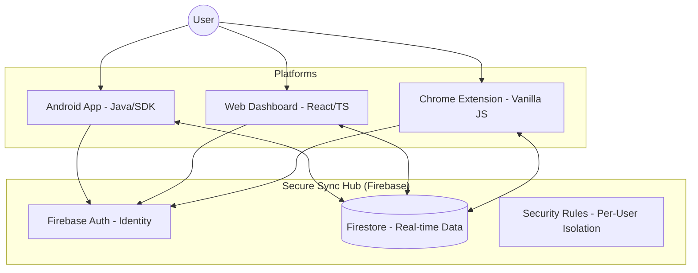
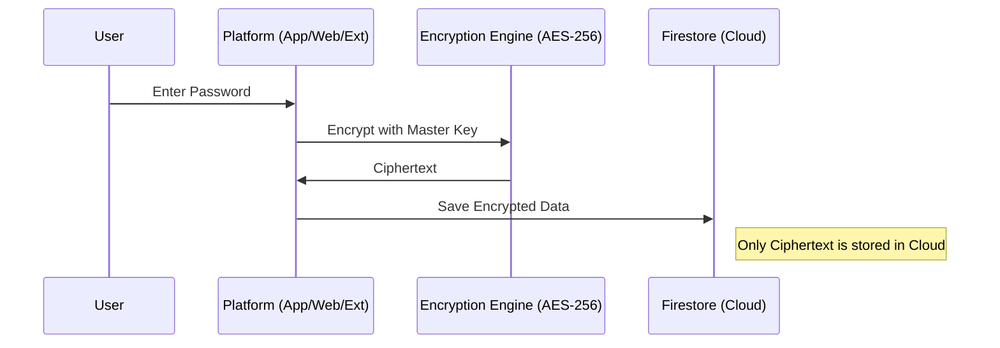

# 🌟 LifeHub: The All-in-One Life Ecosystem

LifeHub is a privacy-first, cross-platform ecosystem designed to unify your digital life. It seamlessly synchronizes sensitive data, tasks, notes, and schedules across Android, Web, and Browser environments using a secure, decentralized mindset.

---

## 🏗️ System Architecture

LifeHub follows a **Hybrid Cloud Architecture** where Firebase acts as the central synchronization hub, while each platform maintains its own optimized logic and local security.

---

## 🔒 Data Security Model

Security is not an afterthought in LifeHub; it is the core foundation.

### 🛡️ Layered Protection
1.  **Local AES-256 Encryption:** All account passwords and secure notes are encrypted *on-device* before reaching the cloud.
2.  **Biometric Gatekeeper:** Mobile access is protected by Android’s Biometric API (Fingerprint/Face Unlock).
3.  **Zero-Key Leakage Policy:** All project API keys are managed via `.env` files and private config templates that are never committed to source control.
4.  **Firestore Isolation:** Security rules ensure that `User A` can never access the path of `User B`.

---

## 📁 Repository Structure

The project is organized as a unified monorepo for easier cross-platform development:

| Directory | Platform | Key Responsibility |
|-----------|----------|-------------------|
| `android/`| **Android** | Native app logic, Biometric Auth, Autofill Services. |
| `web/`    | **Web**     | Central dashboard, React-based UI, Data management. |
| `extension/` | **Extension** | Browser integration, quick TOTP & Calendar access. |

---

## 🛠️ Getting Started

### 1. Android Setup
- **Directory:** `android/`
- **Config:** Copy `google-services.json` to `android/app/`.
- **API Keys:** Add `OPENWEATHER_API_KEY` to `android/local.properties`.

### 2. Web Platform Setup
- **Directory:** `web/`
- **Install:** `npm install`
- **Config:** Create `.env` based on `.env.example`.
- **Run:** `npm run dev`

### 3. Browser Extension Setup
- **Directory:** `extension/`
- **Config:** Create `extension/popup/libs/firebase-config.js`.
- **Install:** Load the `extension/` folder as an "Unpacked Extension" in Chrome.

---

## 🛡️ Security Audit & Git Readiness
This repository has been audited for Git deployment:
- ✅ **Redacted History:** No hardcoded secrets in source files.
- ✅ **Secure Gitignores:** Comprehensive rules for all 3 platforms.
- ✅ **Config Templates:** Standardized `.example` files provided for easy setup.

---

*LifeHub - Simplifying complexity, securing reality.*
